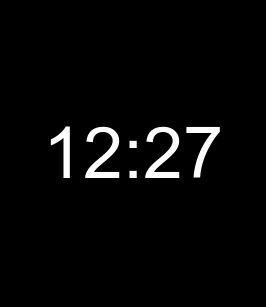

# Bip Six Pulse

**A calm, beautifully legible digital face for Amazfit Bip 6.**



Bip Six Pulse makes time the hero: exceptionally tall, smooth numerals on deep black, framed by a delicate activity ring that follows the rounded contours of the display. It is designed for a quick, effortless glance—day or night.

## Designed for the moments you actually look at your watch

- **Instantly readable time** — a purpose-drawn, high-contrast 24-hour display occupies the screen without feeling crowded.
- **A living separator** — the centred colon breathes gently with a one-second fade out and one-second fade in.
- **Progress with restraint** — your daily step goal flows around the display in soft greys: brighter for progress made, darker for what remains.
- **Useful, never noisy** — the date and step total emerge gradually when the screen wakes, then leave the time in focus.
- **Low-battery awareness** — a subtle warning appears beneath the step count only when charge reaches 20% or below.

Built specifically for the **Amazfit Bip 6** and its 390 × 450 rounded display.

## Get in touch

Bip Six Pulse is created by **Miguel Ferreira**.

- Support: [jmaferreira+zepp@gmail.com](mailto:jmaferreira+zepp@gmail.com)
- Project home: [github.com/jmaferreira/Bip-Six-Pulse](https://github.com/jmaferreira/Bip-Six-Pulse)

## For contributors

This repository includes the Zepp OS project source and the editable artwork for the watch face. To make a local package, install the project dependencies and run:

```sh
npm run build
```

## License

Copyright (C) 2026 Miguel Ferreira. Licensed under [GNU GPL v3.0 only](LICENSE).
